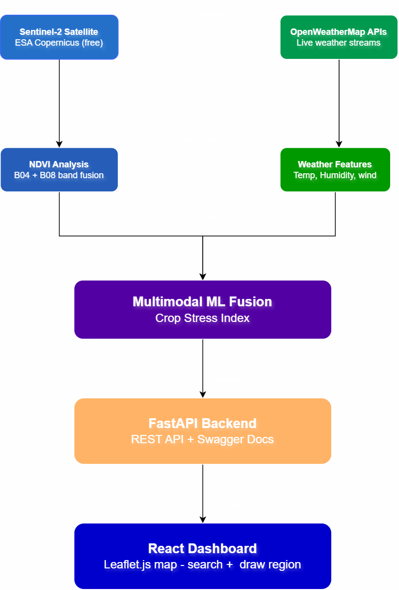

# 🌾 CropSense — Real-time Agricultural Intelligence Platform

> Multimodal ML pipeline integrating Sentinel-2 satellite imagery 
> with live weather data for real-time crop health monitoring


## 🎯 Problem Statement
Traditional crop monitoring requires physical field visits — 
expensive, time-consuming, and not scalable. CropSense provides 
**real-time agricultural intelligence** using satellite imagery 
and live weather data fusion.

## 🏗️ System Architecture



## ✨ Features
- 🛰️ **Real Sentinel-2 Data** — ESA Copernicus satellite imagery
- 🌿 **NDVI Analysis** — Pixel-wise crop health classification
- 🌤️ **Live Weather Integration** — Real-time OpenWeatherMap API
- 🧠 **Multimodal ML Fusion** — Satellite + Weather → Crop Stress Index
- 📊 **Time Series Analysis** — 12-month agricultural calendar
- 🗺️ **Interactive Dashboard** — Search + Draw region on world map
- ⚡ **REST API** — FastAPI with Swagger documentation

## 🔬 ML Pipeline
| Component | Technology |
|---|---|
| Satellite Data | Sentinel-2 L2A (ESA Copernicus) |
| Spectral Analysis | NDVI (NIR-Red)/(NIR+Red) |
| Weather Data | OpenWeatherMap API |
| Fusion Model | Weighted multimodal combination |
| Backend | FastAPI + Python |
| Frontend | React + Leaflet.js |

## 📊 Sample Output — Mehrawal, Aligarh (Nov 2024)
```json
{
  "satellite_data": {
    "healthy_percentage": 34.72,
    "stressed_percentage": 14.28
  },
  "weather_data": {
    "temperature": 38.22,
    "humidity": 23
  },
  "ml_output": {
    "crop_stress_index": 0.235,
    "alert_level": "HEALTHY"
  }
}
```

## 🚀 Quick Start

### Backend
```bash
cd cropsense
pip install -r requirements.txt
uvicorn main:app --reload
```

### Frontend
```bash
cd cropsense-frontend
npm install
npm start
```

## 🌍 Real-World Impact
- Covers **any region worldwide** via interactive map
- Processes **real ESA satellite data** — not synthetic
- Validated on **Mehrawal village, Aligarh, UP** — actual agricultural land
- Applicable to **Google Earth Engine** scale deployments

## 👨‍💻 Author
**Yogesh Kumar** — ML Engineer  
`EfficientNet • FastAPI • React • Geospatial ML • Transfer Learning`